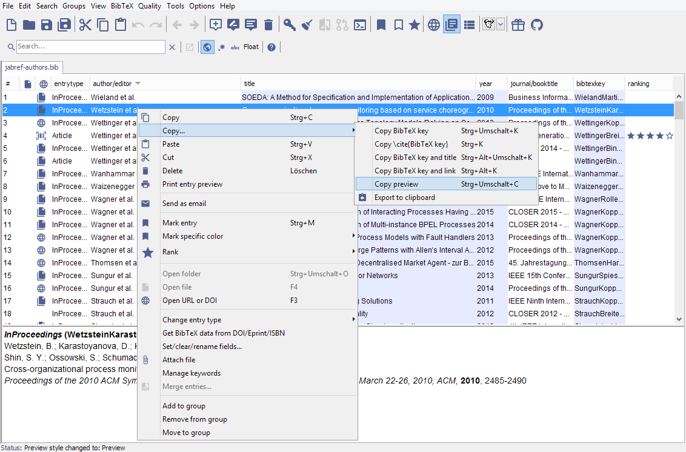
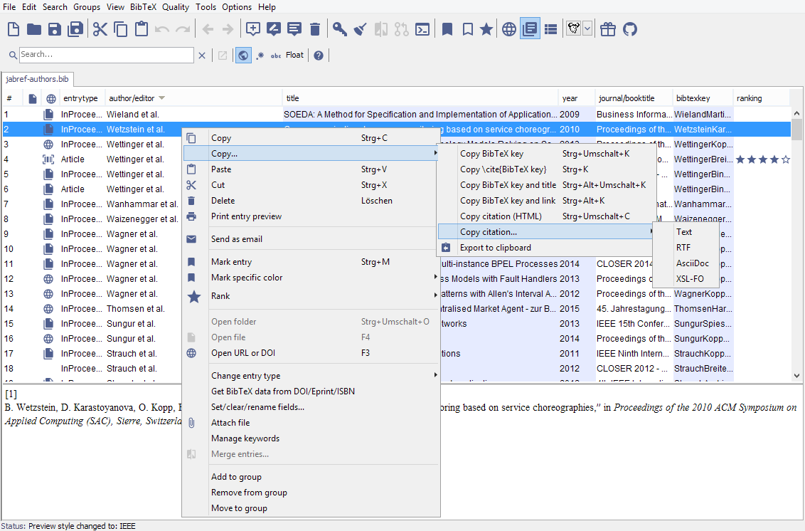

# Copying Citations to the Clipboard

JabRef allows you to copy the selected entries in the currently selected Preview/Citation Style.

To copy the citations follow following steps:
- select the style you want ([see Preview](Preview)) your entries to export
- select the entries you want to export.
- Right-click on an entry to open the contextmenu and Select "Copy..."
  - When the Preview style is active you can copy it via "Copy Preview".
  - When a Citation Style is active you can additionally select the preferred format.

| Screenshot copying the citation while preview is active | Screenshot copying the citation while citation style is active |
|-------------------------|-------------------------|
   |  

## Keybindings

| Keystroke                                         | Command            |
|---------------------------------------------------|--------------------|
| <kbd>Ctrl</kbd> + <kbd>Shift</kbd> + <kbd>C</kbd> | The citations of the currently selected entries will be copied in HTML. |
